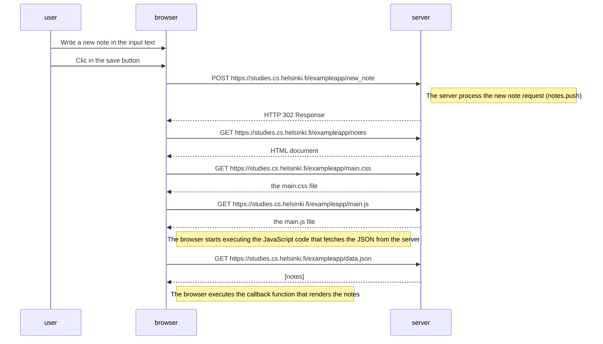

```mermaid
sequenceDiagram
    participant user
    participant browser
    participant server

    user->>browser: Write a new note in the input text
    user->>browser: Clic in the save button
    browser->>server: POST https://studies.cs.helsinki.fi/exampleapp/new_note

    Note right of server: The server process the new note request (notes.push)

    server-->>browser: HTTP 302 Response

    browser->>server: GET https://studies.cs.helsinki.fi/exampleapp/notes
    server-->>browser: HTML document
    browser->>server: GET https://studies.cs.helsinki.fi/exampleapp/main.css
    server-->>browser: the main.css file
    browser->>server: GET https://studies.cs.helsinki.fi/exampleapp/main.js
    server-->>browser: the main.js file

    Note right of browser: The browser starts executing the JavaScript code that fetches the JSON from the server

    browser->>server: GET https://studies.cs.helsinki.fi/exampleapp/data.json
    server-->>browser: [notes]

    Note right of browser: The browser executes the callback function that renders the notes
```